# UAV LoRa safety transponder

> 868 MHz LoRa transponder system for the monitoring and safety of civil drones — BSc thesis project (Computer Engineering, 2024).

<p align="center">
  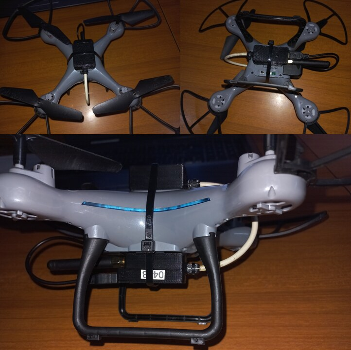<br>
  <em>The transponder is designed to ride on civil UAVs and report their position on request.</em>
</p>

A lightweight, *secondary-radar*-style identification and position-reporting link for civil UAVs. A ground **interrogation station** broadcasts a position request over long-range 868 MHz LoRa; a drone-mounted **transponder** receives it, acquires its GNSS position and replies. A companion **Processing visualizer** plots the reported position on a radar-style display.

The project addresses the communication and robustness challenges of drones operating in real environments, with field testing of range and reliability of the 868 MHz link.

## How it works

```
   Ground interrogation station                 UAV transponder
   (ESP32 + EByte E220, 868 MHz)                 (Arduino Nano + E220 + NEO-6 GPS)
            |                                              |
            |------- broadcast "POSITION" (LoRa) --------->|
            |                                              |  acquire GPS fix
            |<-------- reply: GPS position (LoRa) ---------|
            |
            v
   serial --> Processing visualizer  -->  radar-style position display
```

- The **interrogation station** (ESP32 + EByte E220) broadcasts a fixed `POSITION` interrogation frame over LoRa using fixed addressing on channel 18.
- The **transponder** (Arduino Nano + EByte E220 + u-blox NEO-6 GPS) listens; on receiving the interrogation it reads a GPS fix and transmits its position back to the station.
- The station prints the received position over serial, where the **Processing** sketch renders it on a vector, radar-style map.

<p align="center">
  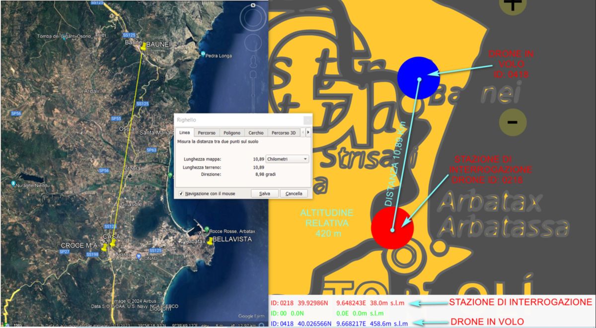<br>
  <em>Ground-station view: the interrogated drone's position plotted on a map (field tests around Tortolì / Arbatax, Sardinia).</em>
</p>

## Hardware

<table>
  <tr>
    <td width="50%">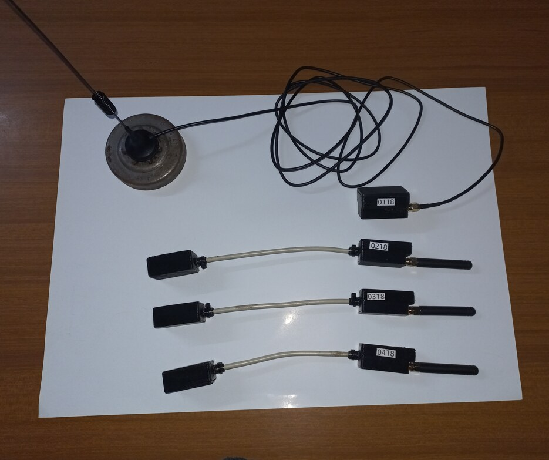</td>
    <td width="50%">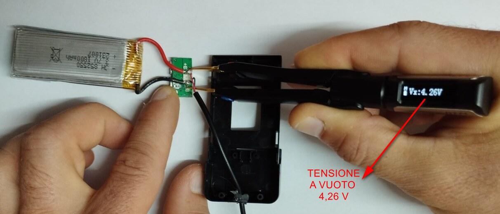</td>
  </tr>
  <tr>
    <td align="center"><em>The two units and the u-blox NEO-6 GPS.</em></td>
    <td align="center"><em>The drone-side transponder in its 3D-printed enclosure.</em></td>
  </tr>
</table>

| Node | MCU | Radio | Other |
|------|-----|-------|-------|
| Interrogation station | ESP32 dev board | EByte E220-900T22D (868 MHz LoRa) | — |
| UAV transponder | Arduino Nano | EByte E220-900T22D (868 MHz LoRa) | u-blox NEO-6 GPS |

Earlier prototypes also used EByte E32 modules.

### Schematics & wiring

The radios and wiring were designed in **KiCad**, with pictorial wiring diagrams drawn for assembly. Full schematics and wiring diagrams (PDF) are in [`hardware/schematics/`](hardware/schematics/).

<p align="center">
  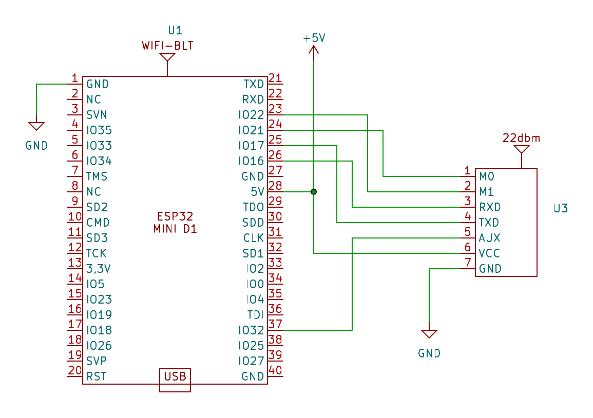<br>
  <em>Interrogation station — electrical schematic (ESP32 D1 mini + EByte E220, KiCad).</em>
</p>

<p align="center">
  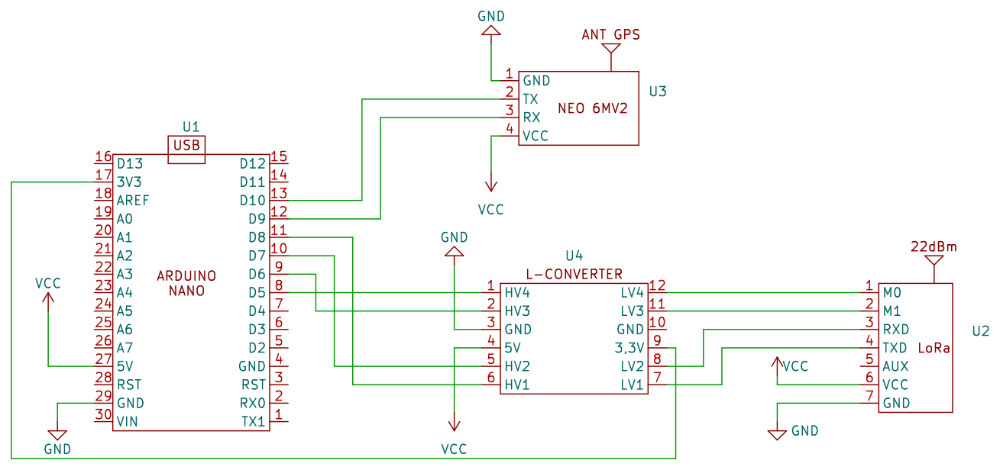<br>
  <em>Transponder — electrical schematic (Arduino Nano + EByte E220 + NEO-6 GPS, level-shifted, KiCad).</em>
</p>

<table>
  <tr>
    <td width="50%">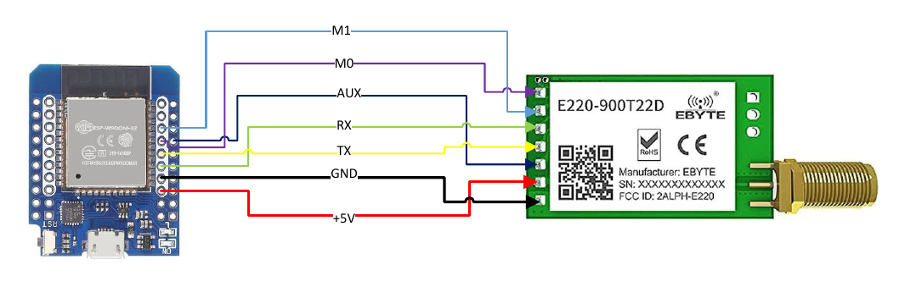</td>
    <td width="50%">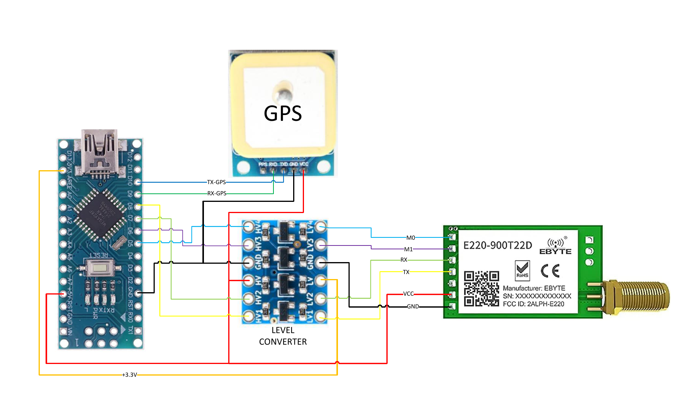</td>
  </tr>
  <tr>
    <td align="center"><em>Station wiring — ESP32 ↔ EByte E220.</em></td>
    <td align="center"><em>Transponder wiring — Arduino Nano ↔ E220 ↔ NEO-6 GPS (level-shifted).</em></td>
  </tr>
</table>

| Unit | Schematic (KiCad) | Wiring diagram |
|---|:---:|:---:|
| **Interrogation station** | [PDF](hardware/schematics/interrogation-station-schematic.pdf) | [PDF](hardware/schematics/interrogation-station-wiring.pdf) |
| **Transponder** | [PDF](hardware/schematics/transponder-schematic.pdf) | [PDF](hardware/schematics/transponder-wiring.pdf) |

### 3D-printed enclosures

A custom enclosure was designed in CAD for each unit — transponder, interrogation station and GPS — and 3D-printed. Full dimensioned drawings (boxes and lids) are in [`hardware/enclosures/`](hardware/enclosures/).

<p align="center">
  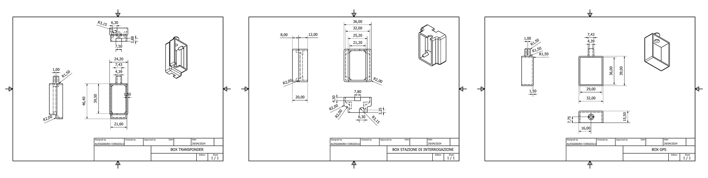<br>
  <em>Dimensioned drawings of the three enclosures (transponder, station, GPS), each with an isometric view.</em>
</p>

<p align="center">
  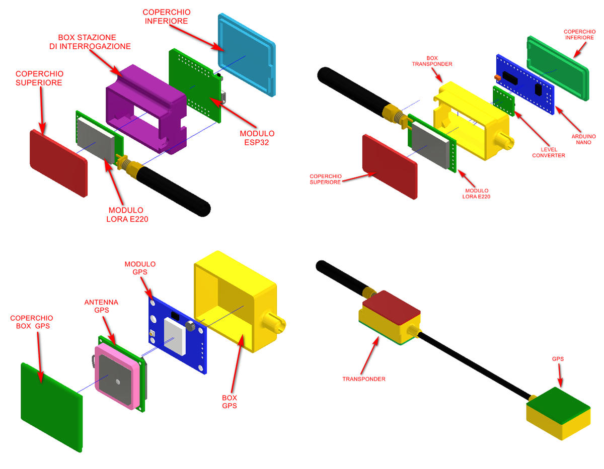<br>
  <em>Exploded and assembly views: each unit (interrogation station, transponder, GPS) and the assembled system.</em>
</p>

## Validation

<p align="center">
  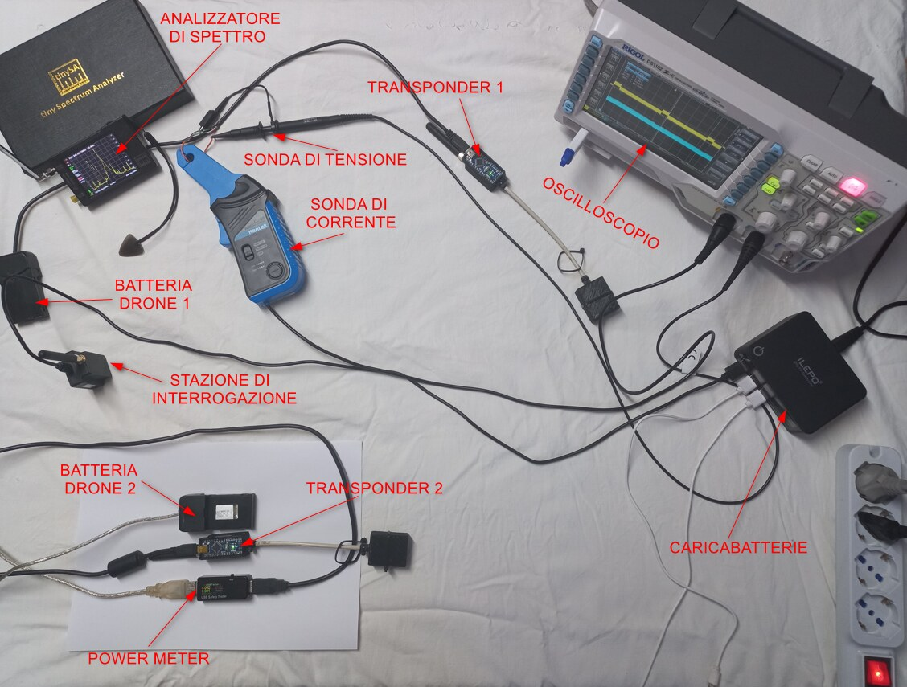<br>
  <em>Bench setup: interrogation station, transponder and voltage/current instrumentation.</em>
</p>

<p align="center">
  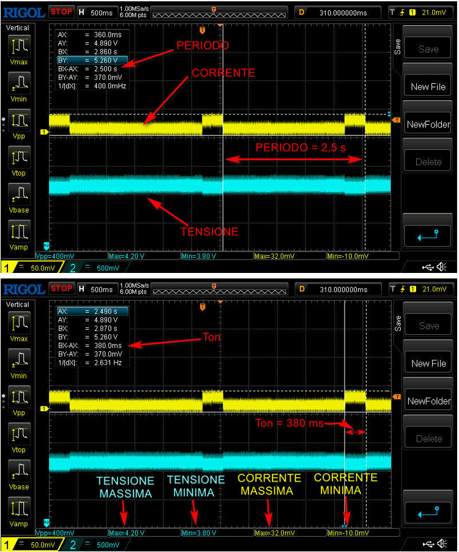<br>
  <em>Signal and power-consumption validation on the bench.</em>
</p>

<p align="center">
  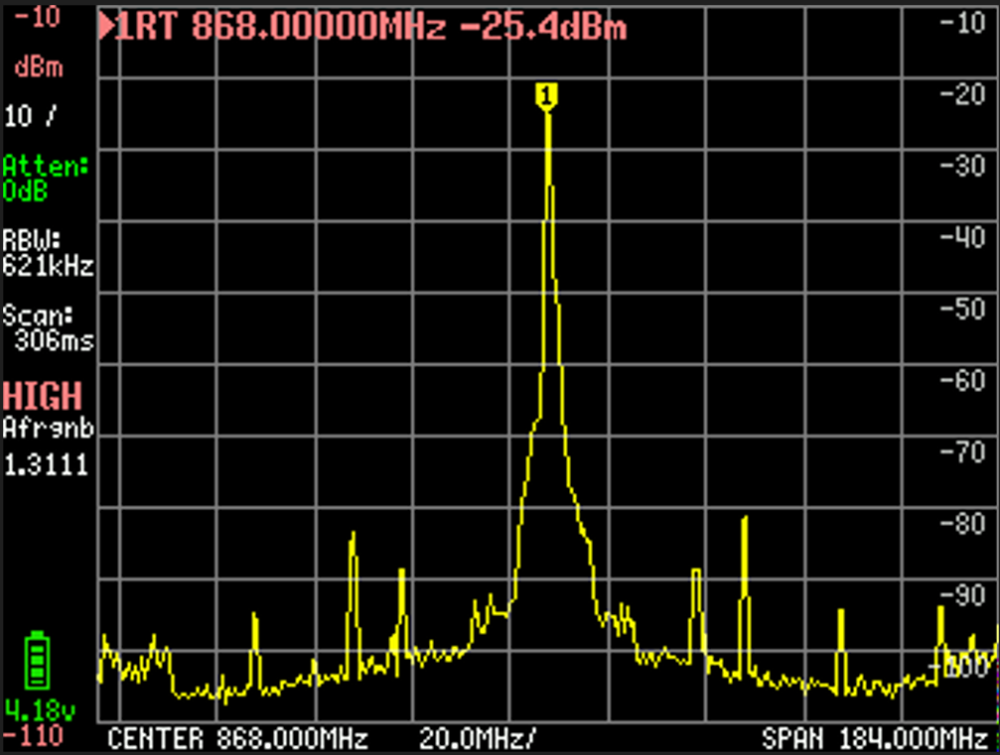<br>
  <em>The 868 MHz LoRa transmission captured on a spectrum analyzer.</em>
</p>

Range and reliability of the 868 MHz link were validated through field testing in real conditions.

## Repository layout

```
transponder/                  drone-side firmware (Arduino Nano)
  TRANSPONDER/                 main sketch + LoRa / GPS / position helpers
  GET_CONFIG_TRANSPONDER/      read EByte E220 configuration
  SET_CONFIG_TRANSPONDER/      write EByte E220 configuration
interrogation_station/        ground-side firmware (ESP32)
  STAZIONE_DI_INTERROGAZIONE/  main sketch + LoRa helper
  GET_CONFIG_STAZIONE.../      read EByte E220 configuration
  SET_CONFIG_STAZIONE.../      write EByte E220 configuration
ground_visualizer/            Processing sketch — vector radar-style display
hardware/enclosures/          dimensioned drawings of the 3D-printed enclosures (PDF)
hardware/schematics/          KiCad schematics + wiring diagrams, per unit (PDF)
docs/images/                  hardware photos, schematics and screenshots
docs/                         full thesis (PDF, Italian)
```

## Build & flash

1. **Arduino IDE** with the [`LoRa_E220` library by Renzo Mischianti (xreef)](https://github.com/xreef/LoRa_E220_Series_Library) for the EByte E220 modules. The transponder uses `SoftwareSerial` (Nano); the station uses the ESP32 `HardwareSerial`. The transponder also needs a GPS-parsing library for the NEO-6 (e.g. TinyGPS).
2. **Configure the radios first:** flash the `SET_CONFIG_*` sketch on each node to program address/channel into the E220, and verify with `GET_CONFIG_*`. The link uses fixed addressing on channel 18.
3. Flash `transponder/TRANSPONDER` to the Arduino Nano and `interrogation_station/STAZIONE_DI_INTERROGAZIONE` to the ESP32.
4. (Optional) Open the `ground_visualizer` sketch in Processing and point it at the station's serial port.

## Context

BSc thesis in **Computer Engineering (L-8), Universitas Mercatorum, 2024 — 90/110.**
Title: *long-range 868 MHz LoRa transponder for the monitoring and safety of civil drones.*

📄 **Read the full thesis** (77 pages, in Italian): [*Studio e sviluppo di un transponder LoRa 868 MHz per il monitoraggio e la sicurezza dei droni ad uso civile*](docs/thesis-LoRa-868MHz-drone-transponder-it.pdf)

## Author

**Alessandro Corgiolu** — System / Embedded Integration & Validation Engineer
GitHub [@corgiolu-labs](https://github.com/corgiolu-labs) · part of a hardware portfolio that includes [JONNY5](https://github.com/corgiolu-labs/jonny5) (VR-teleoperated 6-DoF arm), [ESP32 radar](https://github.com/corgiolu-labs/esp32-radar-tracking) and [RASPYNVERTER](https://github.com/corgiolu-labs/raspinverter).

## License

MIT — see [LICENSE](LICENSE).
